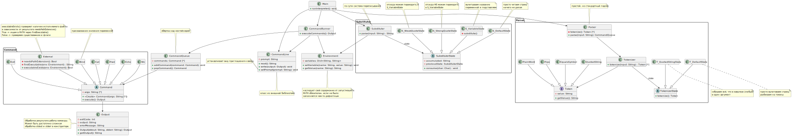

# Архитектура CLI

## UML диаграмма классов



Также можно найти по [ссылке](https://github.com/KubEF/architecture-learn-materials/blob/main/cli/cli.svg).

## Архитектурное описание

* `Main` запускает интерпретатор и синхронизирует работу всех компонентов.
Он же отвечает за "аккуратное" завершение работы шелла.

* `CommandLine` отвечает за взаимодействие пользователя с интерпретатором (чтение и запись).
При этом мы считаем, что для этих целей используется внешняя библиотека.

* `Environment` Хранит переменные среды, даёт к ним доступ

### Парсинг

Парсинг двухэтапный:

1. с помощью `Substituter` производится подстановка всех переменных окружения с учётом квотирования;
2. затем `Parser` разбирает строку со всеми подстановками в `CommandQueue`.
При этом подразумевается, что новые переменные появится при разборе команды не могут: ни через `var=val | $var`, ни через

```bash
> var=val
> p1 = '$v'
> p2 = ar
> $p1$2
```

Во втором случае просто получится строка `$var`.

#### Технические подробности

* `Parser` так же связан с `Tokenizer`, который предварительно разбирает вход на токены.
* `Substituter` и `Tokenizer` под капотом используют паттерн "Состояние" для определения возможных действий над входом.

### Исполнение команд

* `CommandRunner` исполняет команды в заданном порядке, отвечает за передачу выхода одной команды на вход другой и передачу итогового ответа. На этапе исполнения переменные среды могут только добавляться (или перезаписываться).

* `CommandQueue` содержит очередь команд. По сути хранит порядок, заданный пайпами.

* `Command` является абстракцией команд, которые создаются на моменте парсинга.
  * `Cat`, `Pwd`, `Echo`, `Wc`, `Exit`, `Bind` -- реализуют команды из задания
  * `External` помимо переопределения метода `execute()` разбирается с тем, передан ли полный путь к исполняемому файлу, в ином случае пытается его найти в `PATH`.

* `Output` содержит результат выполнения команды. Обрабатывает `stdout` и `stderr` и приводит в единообразную форму. `CommandLine.write()` обрабатывает этот `Output` и выводит корректный вывод в `stdout` и `errorMessage` в `stderr`.

## Процесс работы приложения

Приложение работает по следующему алгоритму

1. Запускаем интерпретатор.
2. Вводим команду/ы в консоль
3. Строку обрабатывает сначала `Substituter`, затем `Parser`, в итоге получается `CommandQueue`.
4. `CommandRunner`, следуя полученной инструкции от `Parser`, запускает нужные методы через абстрактный класс `Command`.

## Добавление новой команды

Для добавления новой команды необходимо

* Создать новый класс, реализующий интерфейс Command.
* Модифицировать Parser.
