# Паттерны проектирования: Краткое описание

## Структурные паттерны

### Компоновщик (Composite)

Используется для представления древовидной структуры объектов. Позволяет работать с группой объектов так же, как с единичным объектом.

### Декоратор (Decorator)

Динамически добавляет объекту новые функциональности, не изменяя его структуры. Полезен для гибкого расширения поведения.

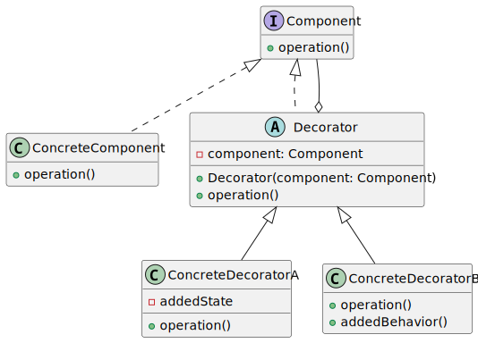

### Адаптер (Adapter)

Позволяет объектам с несовместимыми интерфейсами работать вместе, преобразуя интерфейс одного объекта в интерфейс, ожидаемый другим.

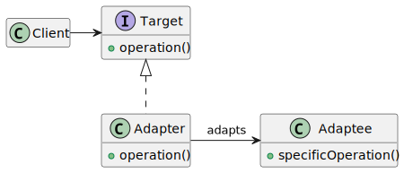

### Заместитель (Proxy)

Предоставляет объект-заместитель, который контролирует доступ к реальному объекту, например, для добавления кэширования или защиты.

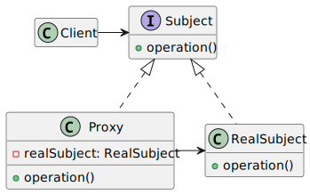

### Фасад (Facade)

Предоставляет упрощённый интерфейс к сложной системе классов, скрывая её детали.

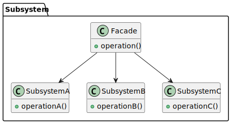

### Приспособленец (Flyweight)

Оптимизирует использование памяти за счёт повторного использования объектов. Применяется для управления большим количеством мелких объектов.

## Порождающие паттерны

### Фабричный метод (Factory Method)

Определяет интерфейс для создания объектов, позволяя подклассам решать, какой класс создавать.

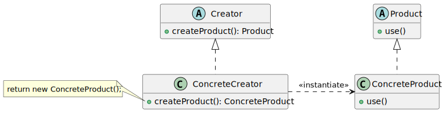

### Абстрактная фабрика (Abstract Factory)

Позволяет создавать семейства взаимосвязанных объектов без указания их конкретных классов.

### Одиночка (Singleton)

Обеспечивает существование только одного экземпляра класса и предоставляет глобальную точку доступа к нему.

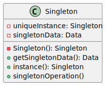

### Прототип (Prototype)

Позволяет создавать объекты на основе копирования существующих экземпляров.

## Поведенческие паттерны

### Стратегия (Strategy)

Определяет семейство алгоритмов, инкапсулирует их и позволяет подменять алгоритмы на лету.

### Шаблонный метод (Template Method)

Определяет скелет алгоритма в базовом классе, позволяя подклассам переопределять отдельные шаги.

### Посредник (Mediator)

Обеспечивает взаимодействие между объектами, уменьшая их взаимозависимость.

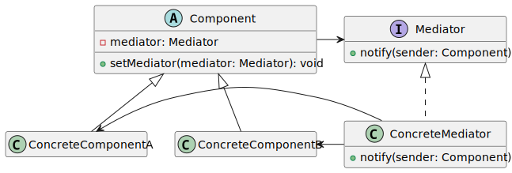

### Команда (Command)

Инкапсулирует запрос в виде объекта, позволяя откладывать его выполнение или поддерживать историю запросов.

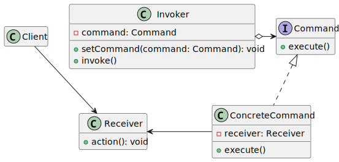

### Цепочка ответственности (Chain of Responsibility)

Передаёт запрос по цепочке обработчиков до тех пор, пока он не будет обработан.

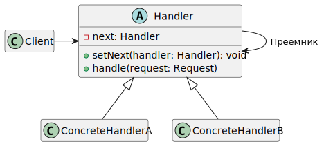

### Наблюдатель (Observer)

Позволяет одному объекту уведомлять другие о своих изменениях.

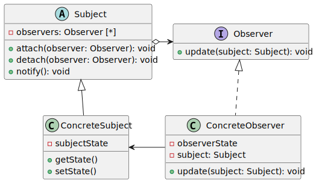

### Состояние (State)

Позволяет объекту изменять своё поведение в зависимости от внутреннего состояния.

### Посетитель (Visitor)

Позволяет добавлять новые операции для классов без изменения их структуры, перемещая реализацию в отдельный класс.

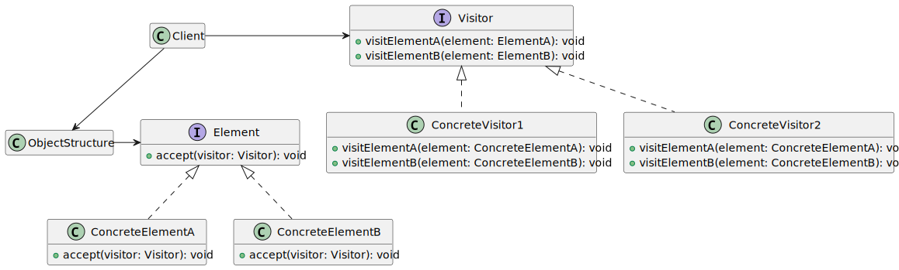

### Хранитель (Memento)

Сохраняет внутреннее состояние объекта для последующего восстановления, не нарушая его инкапсуляции.

### Интерпретатор (Interpreter)

Реализует интерпретацию заданного языка или выражения.

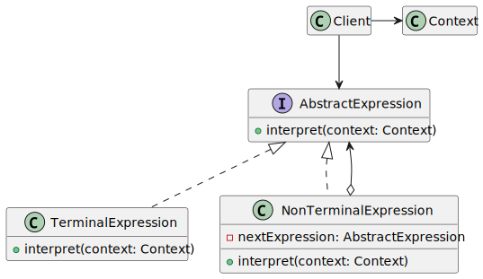

### Итератор (Iterator)

Предоставляет доступ к элементам коллекции без раскрытия её внутреннего представления.

